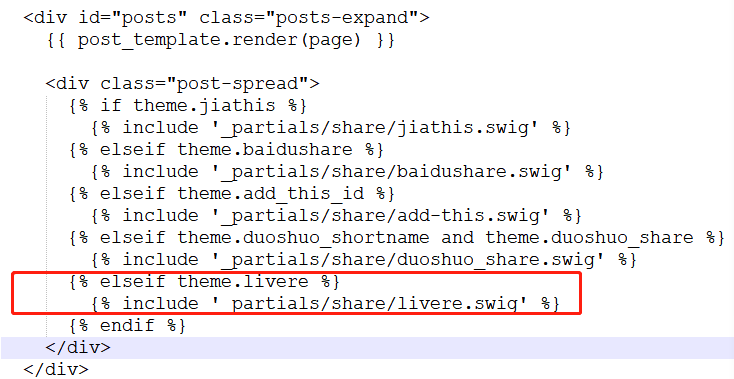

# 1什么是Hexo?
Hexo 是一个快速、简洁且高效的博客框架。Hexo 使用 Markdown（或其他渲染引擎）解析文章，在几秒内，即可利用靓丽的主题生成静态网页。
# 2.Hexo的安装
安装 Hexo 相当简单。然而在安装前，您必须检查电脑中是否已安装下列应用程序：
* Node.js
* Git

这两个软件的安装不再详述。下面重点介绍Hexo的安装。

`npm install -g hexo`

安装完成后，创建一个hexo文件夹，在git bash中执行

`hexo init 文件名`
<!--more-->
将其作为博文存放地址。
然后进入文件夹内，执行hexo g，hexo s就可以打开本地预览。通过localhost:4000访问。
如果过程中存在任何问题，执行npm audit fix查看是否缺少什么组件。将缺少组件安装完毕，再执行即可。插件安装的基本命令如下

`npm install hexo-generator-index --save`


# 3.Hexo基本语法
## 3.1 每次更新github的常用步骤
1. hexo new "postName" #新建文章
2. hexo new page "pageName" #新建页面
3. hexo generate #生成静态页面至public目录
4. hexo server #开启预览访问端口（默认端口4000，'ctrl + c'关闭server）
5. hexo deploy #部署到GitHub
6. 组合命令：
hexo s -g #生成并本地预览
hexo d -g #生成并上传

# 4.注意
## 4.1 域名访问
每次更新完成后，要登录github，进入setting，设置Custom domain为你的域名(github会自动设置CNAME)，才能通过你自己的域名来访问。

## 4.2 hexo d 报错
hexo d后 ERROR Deployer not found: git

没有安装 hexo-deployer-git ,执行命令 npm install hexo-deployer-git --save

## 4.3 上传图片问题

1. cd到博客根目录下 查看_config.yml文件 查找 post_asset_folder 字段确定post_asset_folder 设置为true -> post_asset_folder:true

2. 当您设置 post_asset_folder 参数后，在建立文件时，Hexo 会自动建立一个与文章同名的文件夹，您可以把与该文章相关的所有资源都放到此文件夹内，这样就可以更方便的使用资源。

3. 到博客的根目录下执行 npm install https://github.com/CodeFalling/hexo-asset-image --save 命令来进行插件的安装。

4. 然后创建一文章 hexo new "test" 然后查看博客的 ../source/_posts 目录下的文件，会看到存在一个test 文件夹 和 test.md 文件

# 5.修改Hexo主题
本文采用的是NexT的主题，具体安装设置请见帖子[https://www.jianshu.com/p/33bc0a0a6e90]

# 6.添加标签

## 6.1 添加about标签
在blog目录下使用命令`hexo new page about`，会看到source目录下生成了一个about文件夹，里面包含一个index.md。在这个文件内，我们可以编写一些about的信息。
```
---
title: 关于我
date: 2018-11-16 11:50:20
type: "about"
comments: false
---
自定义内容
```
然后，进入themes/next(进入你使用的主题下)打开_config.yml，在menu中添加about的链接。
```
menu:
  home: / || home
  about: /about/ || user
  tags: /tags/ || tags
  categories: /categories/ || th
  archives: /archives/ || archive
  schedule: /schedule/ || calendar
  sitemap: /sitemap.xml || sitemap
  commonweal: /404/ || heartbeat
```
在你的主题目录下的zh-Han.yml文件中的menu_icons中添加
```
menu_icons:
  enable: true
  # icon mapping
  home: home
  about: user
  categories: th
  tags: tags
  archive: archives
  schedule: schedule
  sitemap: sitemap
  commonweal: heartbeat
```
## 6.2 添加categories和tags标签
基本同上
# 7.修改背景图片

首先找到一个背景图片放到 hexo（hexo工程文件）-> themes -> next -> source -> images 的路径下；
hexo（hexo工程文件）-> themes -> next -> source -> css -> _custom ，找到路径下的custom.styl文件，在文件的最上方加上一代码:
```
body {
 background:url(/images/background.jpg);
 height: 100%;width: 100%;
 background-size:cover;
 }
 ```
 # 8.添加评论功能

 使用的是来必力的评论系统，参考文章[https://blog.csdn.net/qq_41923622/article/details/82966186]


 基本步骤：
 * 在livere官网[https://www.livere.com/] 注册账号
 * 注册完成登录时会给你的注册邮箱发一个验证码!!!全是韩文，看不懂。。
 * 选择City版,安装。会让输入你网站的域名，网站名等。之后会生成City版的安装代码。
 * 在主题中更改：由于设置的时NexT主题，所以进入你的{博客路径}/themes/next/_config.yml,增加如下内容：
```
#Livere评论系统
livere:
  livere_uid: 填入安装代码的data-uid。
```

* 在{博客路径}/themes/next/layout/_partials/share/下添加livere.swig文件，将安装代码复制进去，保存。
* {博客路径}/themes/next/layout/post.swig文件中添加下图所示红框处代码


* 重新部署博客[hexo g /hexo d]查看效果。
# 9.设置个人头像
将头像添加到主题下的source/images/目录下。在主题配置文件添加
`avatar: https://dyddp.top/images/avatar.jpg`
最后在主题下的source/css/components/sidebar-author.styl文件下的.site-author-image添加
`background:url(/images/avatar.jpg);` 即可。

# 10.阅读量统计
* 主题下_config.yml文件修改
```
busuanzi_count:
  # count values only if the other configs are false
  enable: true
  # custom uv span for the whole site
  site_uv: true
  site_uv_header: <i class="fa fa-user"></i> 访问人数
  site_uv_footer: 人
  # custom pv span for the whole site
  site_pv: true
  site_pv_header: <i class="fa fa-eye"></i> 总访问量
  site_pv_footer: 次
  # custom pv span for one page only
  page_pv: true
  page_pv_header: <i class="fa fa-file-o"></i> 阅读数
  page_pv_footer:
```
* 修改busuanzi的js地址，路径/layout/analytics/busuanzi_count.swig文件，src改为
`https://busuanzi.ibruce.info/busuanzi/2.3/busuanzi.pure.mini.js`
即可。

# 11.其他
可能有人跟我一样遇到了带你麻烦，那就是主页面的文章列表中，博客内容全部显示出来而不是只显示文章一部分和 阅读全文》 按钮，这样显得首页的列表很杂乱和冗长，其实要解决这个问题很简单，只需要在我们编写markdown内容的时候，在适当的位置假如如下标签：

`<!--more-->`

那么在首页显示的部分就是此标签前面的文章内容，而非全文显示：

# 12.更多功能设置
请移步网址[https://blog.csdn.net/fanxiaobin577328725/article/details/79209975]查看更多设置。
