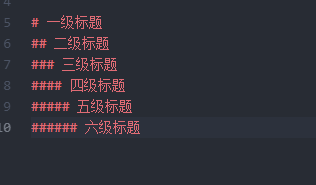

Markdown是一种可以使用普通文本编辑器编写的标记语言，通过简单的标记语法，它可以使普通文本内容具有一定的格式。

# 1.标题

**按照字体大小一共有六级标题。注意，#号后必须有空格。**
<!--more-->



我们可以在我们可以在标签内容结尾+空格+#来闭合标签，如：


## 2.列表：
列表分为有序列表和无序列表。
无序列表可以用* ， + ， — 来创建，推荐使用*。


有序列表只有下面一种方式，**注意，数字后面的点只能是英文的点。有序列表的序号是根据第一行列表的数字顺序来的。**


## 3.区块的引用：
语句前加一个>，这句话就是引用，注意>后要一个空格。


## 4.分割线：
分割线可以由* - _（星号，减号，底线）这3个符号的至少3个符号表示且不需要连续，中间有空格也可以。建议用减号。

## 5.链接
markdown支持2种链接方式：行内式和参数式，不管是哪一种，链接文字都是用 [方括号] 来标记。
行内式的链接格式是：链接的文字放在[]中，链接地址放在随后的（）中。链接还可以带title属性，在链接地址后面空一格，然后用引号引起来。
参数式后面的标签可以用""，'',或者()括起来均可以。


## 6.图片：
图片也有2种方式：行内式和参数式。
用法跟链接基本一样，唯一的不同就是，图片前面要写一个！。


## 7.代码框
只有一行代码，可以在代码首尾用``括起来。
多行代码，则在代码上面一行和代码尾部下面一行都用```。

## 8.表格：
写法：
I之间代表一个单元格内的内容。第一行写完后第二行要写|:----- |:--- |:------ |表示格式，不写这一行表格外包起来的线框就不全。

另外:卸载左边表示左对齐，右边表示右对齐，第三行的数据如果第四行不再写类似第二行的格式设置，则继续跟随第二行的格式。


效果如下


## 9.加粗和倾斜：

加粗：要加粗的语句前后加上两个星号或下划线。

倾斜：要倾斜的语句前后加上一个星号或下划线。


## 10.转义：
这里列举一些常用的转义字符。


## 11.删除线

在要打上删除线的文字前后加上~~。


